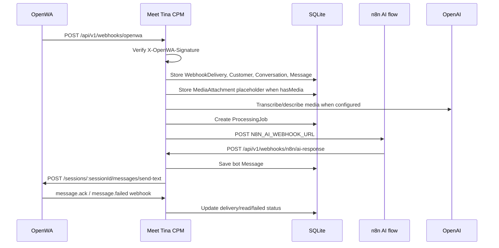

# Meet Tina CRM

A complete but intentionally simple CRM for Meet Tina. It stores customers, flexible profile attributes, WhatsApp conversations, and full message history from OpenWA webhooks delivered directly or through n8n.

## Architecture

- `backend/`: NestJS, TypeScript, Prisma ORM, SQLite, REST API, Swagger, API-key auth.
- `frontend/`: React, Vite, TypeScript dashboard.
- `tinabrain/`: separate Python LangGraph/LangChain chatbot service that talks to CPM through REST APIs.
- `docker-compose.yml`: backend, frontend, and persistent SQLite volume.

SQLite JSON-shaped fields are stored as serialized JSON strings so the application stays portable. When moving to PostgreSQL, those fields can become native `Json` columns with minimal service changes.

## Setup

```bash
npm install
cp backend/.env.example backend/.env
cp frontend/.env.example frontend/.env
```

Set the same API key in both env files:

```bash
# backend/.env
API_KEY=change-me
OPENWA_WEBHOOK_SECRET=change-me
DATABASE_URL="file:./dev.db"

# frontend/.env
VITE_API_URL=http://localhost:3000/api/v1
VITE_API_KEY=change-me
```

## Database

```bash
cd backend
npm run prisma:generate
npm run prisma:migrate -- --name init
```

Back up SQLite:

```bash
cp backend/prisma/dev.db "backend/prisma/dev-$(date +%Y%m%d-%H%M%S).db"
```

## Local Development

```bash
npm run dev:backend
npm run dev:frontend
```

URLs:

- Frontend: `http://localhost:5173`
- Backend API: `http://localhost:3000/api/v1`
- Health: `http://localhost:3000/api/v1/health`
- Swagger: `http://localhost:3000/api/docs`

## Docker

```bash
API_KEY=change-me OPENWA_WEBHOOK_SECRET=change-me docker compose up --build
```

SQLite is persisted in the `sqlite-data` Docker volume.

For production, the frontend API URL and dashboard API key must be provided before building the frontend image because Vite embeds `VITE_*` variables into the static JavaScript bundle:

```bash
API_KEY="your-backend-api-key" \
VITE_API_KEY="your-backend-api-key" \
CPM_PUBLIC_URL="https://cpm.meettina.net" \
CPM_FRONTEND_URL="https://dashboard.meettina.net" \
VITE_API_URL="https://cpm.meettina.net/api/v1" \
OPENWA_WEBHOOK_SECRET="your-webhook-secret" \
docker compose up --build
```

If the dashboard is still calling localhost after changing these values, rebuild the frontend container with `docker compose build --no-cache frontend`.

## API Authentication

All API endpoints except `GET /api/v1/health` require:

```http
X-API-Key: change-me
```

The OpenWA webhook also accepts:

```http
X-OpenWA-Webhook-Secret: change-me
```

when `OPENWA_WEBHOOK_SECRET` is configured to a real value.

## Key Models

- `Customer`: profile, identifiers, wanted service, interests, profile summary, internal notes, metadata.
- `CustomerAttribute`: flexible key-value customer facts, unique by `customerId + key`.
- `Conversation`: WhatsApp conversation container per customer/chat/session.
- `Message`: incoming/outgoing message with OpenWA IDs, idempotency keys, and raw payload.

## n8n HTTP Request Examples

1. Receive OpenWA webhook

```http
POST http://localhost:3000/api/v1/webhooks/openwa
X-API-Key: change-me
Content-Type: application/json

{{$json}}
```

2. Lookup customer by WhatsApp ID

```http
GET http://localhost:3000/api/v1/customers/lookup?whatsappId={{$json.data.from}}
X-API-Key: change-me
```

3. Fetch chatbot context

```http
GET http://localhost:3000/api/v1/customers/{{$json.customer.id}}/context?messageLimit=20
X-API-Key: change-me
```

4. Save incoming message manually

```http
POST http://localhost:3000/api/v1/messages
X-API-Key: change-me
Content-Type: application/json

{
  "customerId": "customer-uuid",
  "conversationId": "conversation-uuid",
  "externalMessageId": "openwa-message-id",
  "direction": "incoming",
  "senderType": "customer",
  "messageType": "text",
  "body": "I need a reservation chatbot.",
  "receivedAt": "2026-07-19T22:07:10.000Z",
  "rawPayload": {}
}
```

5. Save outgoing bot message

```http
POST http://localhost:3000/api/v1/messages
X-API-Key: change-me
Content-Type: application/json

{
  "customerId": "customer-uuid",
  "conversationId": "conversation-uuid",
  "externalMessageId": "openwa-message-id",
  "direction": "outgoing",
  "senderType": "bot",
  "messageType": "text",
  "body": "Hello! How can Tina help your business today?",
  "sentAt": "2026-07-19T22:07:00.000Z",
  "rawPayload": {}
}
```

6. Update profile summary

```http
PATCH http://localhost:3000/api/v1/customers/customer-uuid/profile-summary
X-API-Key: change-me
Content-Type: application/json

{
  "freeTextProfile": "Owns a restaurant and is interested in WhatsApp reservation automation.",
  "interests": ["reservation chatbot", "customer support automation"],
  "status": "qualified"
}
```

7. Upsert custom attributes

```http
POST http://localhost:3000/api/v1/customers/customer-uuid/attributes
X-API-Key: change-me
Content-Type: application/json

{
  "attributes": {
    "business_type": "restaurant",
    "requested_service": "reservation chatbot",
    "budget": 5000,
    "follow_up_required": true
  }
}
```

Suggested n8n flow:

`OpenWA Webhook -> Normalize Payload -> POST /webhooks/openwa -> GET /customers/{customerId}/context -> AI Chatbot -> Send through OpenWA -> POST /messages -> PATCH /customers/{customerId}/profile-summary`

## OpenWA Gateway Flow



Gateway endpoints:

- `POST /api/v1/webhooks/openwa`: public OpenWA webhook, signed by `OPENWA_WEBHOOK_SECRET` using `X-OpenWA-Signature: sha256=<hex>`.
- `POST /api/v1/webhooks/n8n/ai-response`: n8n AI callback, authenticated with `X-CPM-Callback-Secret`.
- `GET /api/v1/processing-jobs`, `GET /api/v1/processing-jobs/:id`, `POST /api/v1/processing-jobs/:id/retry`.
- `GET /api/v1/media/:id`.
- `POST /api/v1/messages/:id/retry`.
- `POST /api/v1/conversations/:id/send`.

Required production variables are listed in `backend/.env.example`. When `N8N_AI_WEBHOOK_URL`, `OPENWA_API_KEY`, or `OPENAI_API_KEY` are unset or left as `change-me`, CPM records mocked/deferred states instead of calling those external services.

## TinaBrain

`tinabrain/` is a separate Python LangGraph/LangChain service for chatbot reasoning and CRM tooling. It loads its main prompt from `tinabrain/prompts/main_chatbot.md`, builds conversation history from CPM context, and uses tools that call CPM APIs to update profile fields, `wantedService`, custom attributes, statuses, interests, and internal notes.

Run with the existing conda environment:

```bash
conda activate langgraph
cd tinabrain
pip install -r requirements.txt
cp .env.example .env
python run.py
```

Health:

```bash
curl http://localhost:8010/health
```

To route CPM AI jobs directly to TinaBrain, set CPM:

```env
N8N_AI_WEBHOOK_URL=http://tinabrain-lan-host:8010/webhooks/cpm
N8N_OUTBOUND_API_KEY=your-cpm-to-tinabrain-secret
N8N_AI_CALLBACK_SECRET=your-cpm-callback-secret
```

Then set TinaBrain:

```env
CPM_API_BASE_URL=https://cpm.meettina.net/api/v1
CPM_API_KEY=your-cpm-api-key
CPM_CALLBACK_SECRET=your-cpm-callback-secret
TINABRAIN_INBOUND_API_KEY=your-cpm-to-tinabrain-secret
OPENAI_API_KEY=your-openai-api-key
```

## Example Curl

```bash
curl -H "X-API-Key: change-me" http://localhost:3000/api/v1/health
curl -H "X-API-Key: change-me" http://localhost:3000/api/v1/customers
```

## Quality Commands

```bash
cd backend
npm run lint
npm test
npm run build

cd ../frontend
npm run build
```

## Migrating Later to PostgreSQL

1. Change `DATABASE_URL` to a PostgreSQL connection string.
2. Change `provider = "sqlite"` to `provider = "postgresql"` in `backend/prisma/schema.prisma`.
3. Convert serialized JSON string fields (`interests`, `metadata`, `rawPayload`, `CustomerAttribute.value`) to Prisma `Json` fields if desired.
4. Generate and run a new Prisma migration.
5. Export SQLite data and import it into PostgreSQL with a short migration script.
